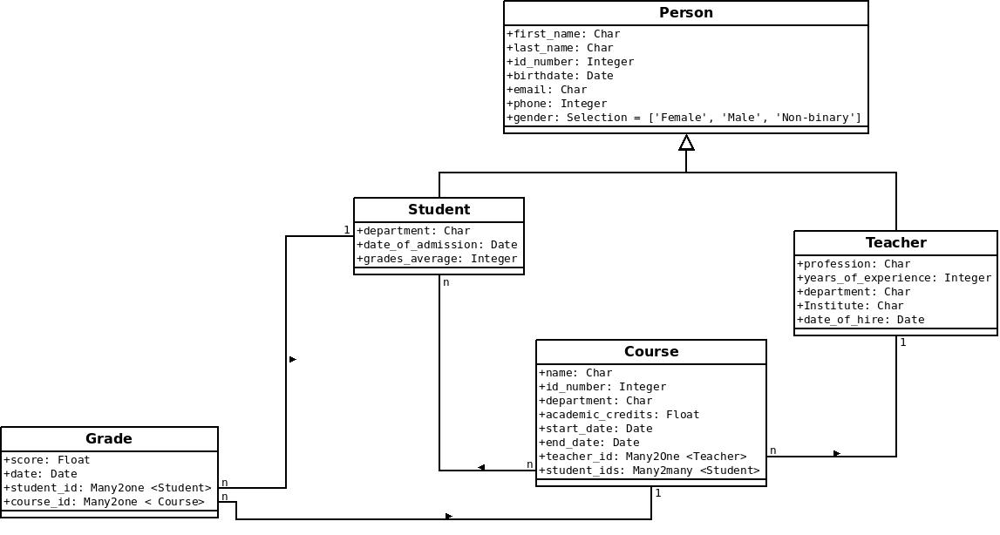

# ASYNC - IMPORTER APP

ASYNC - IMPORTER APP written in Django

## Overview
* There are models for Student, Teacher, Grade, and Couser.
* Users : Can import data for models from files with CSV or XLS, XLSX extension.
* Admin users: Can manage all models from admin panel

## Modeling
)

## Quick Start
1. Clone this project in your computer.
2. Set up The Python development  enviroment.
   3. ``` virtualenv data_importer_env ```
   4.  ``` source data_importer_env/bin/activate ```
   5. ``` pip install -r requirements.txt ```
3. create a file called ".env" with the SECRET_KEY variable with a different value than what is shown in the example file
 ```
   python manage.py makemigrations
   python manage.py migrate   
   python manage.py createsuperuser # Create a superuser only, if  necessary
   python manage.py runserver   
   ```
4. Onpen a browser to    `http://localhost:8000/admin/` to open the admin site


## NOTES
To be continue...
